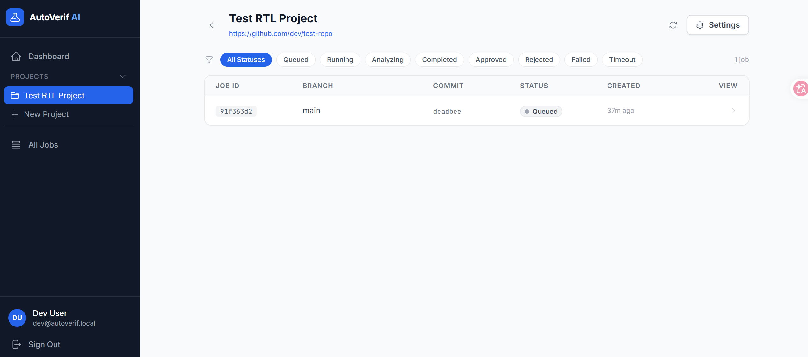
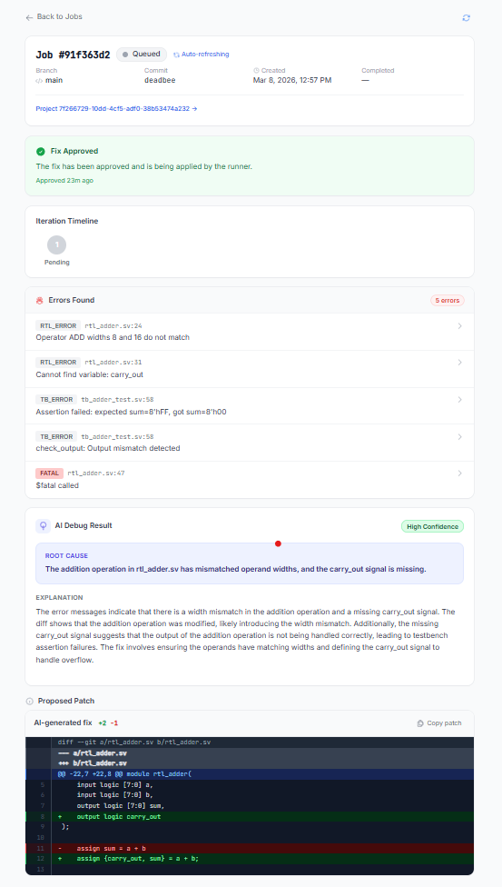

# AutoVerif AI — How to Use It

---

## Product Roadmap

### v1 — Foundation (Current)

Core pipeline is live. Covers the full loop from git push to AI-proposed patch with human approval.

| # | Feature | Status |
|---|---------|--------|
| 1 | Git push webhook trigger | Done |
| 2 | Local runner (Verilator) | Done |
| 3 | Log parser — RTL_ERROR / TB_ERROR / FATAL classification | Done |
| 4 | Debug Agent (GPT-4o) — root cause + unified diff patch | Done |
| 5 | Iterative refinement loop (max 3 iterations) | Done |
| 6 | Human-in-the-loop approval gate (Approve / Reject / Expire) | Done |
| 7 | Web dashboard — job list, AI result, syntax-highlighted diff | Done |
| 8 | GitHub + GitLab OAuth | Done |
| 9 | Email notification on fix ready | Done |

**Target users:** Chip startups, FPGA design teams, open-source RTL projects using Verilator.

---

### v2 — Reach & Stickiness (Next)

Removes the biggest adoption friction, broadens simulator support, and adds the coverage data that makes verification quality visible.

| # | Feature | Value |
|---|---------|-------|
| 1 | **Hosted runner** — no local install required | Removes #1 setup friction; cloud-managed execution |
| 2 | **Icarus Verilog support** | Opens university and open-source market |
| 3 | **Coverage reporter** — line, toggle, branch coverage | Answers "is this design well-tested?"; unlocks exec dashboard |
| 4 | **Executive dashboard** — coverage trends, job history, pass rate | Makes verification quality visible to engineering managers |
| 5 | **Slack / Teams notifications** | Meets engineers where they work |
| 6 | **Confidence threshold gate** — configurable per project | High-confidence patches surface automatically; medium/low show root cause only |
| 7 | **RAG on project history** — AI learns from past bugs in your codebase | Improves patch quality over time; first step toward a defensible moat |

---

### v3 — Moat & Upmarket (Future)

Moves into enterprise accounts and builds the proprietary knowledge layer that makes AutoVerif hard to replicate.

| # | Feature | Value |
|---|---------|-------|
| 1 | **VCS / Questa / Xcelium support** | Unlocks commercial teams; opens $5K–$20K/yr deal size |
| 2 | **Fine-tuned model on RTL error patterns** | AI trained on hardware-specific failures; out-performs generic LLMs |
| 3 | **Formal verification integration** — lint + property checking hooks | Shifts verification left; catches bugs before simulation |
| 4 | **GitHub PR / GitLab MR native bot** — approve patches via PR comment | Zero-friction review workflow; feels native to the dev process |
| 5 | **Multi-project analytics & CI badge** | Team-wide verification health visible to CTOs and investors |
| 6 | **SSO + RBAC + audit log** | Enterprise security and compliance requirements |

---

## One-time Setup

### 1. Start the stack

```bash
cd AutoVeri
docker-compose up -d
```

Wait ~10 seconds. Four services start:

| Service | Port |
|---|---|
| Backend API | 8000 |
| Frontend dashboard | 5173 |
| PostgreSQL | 5432 |
| Redis | 6379 |

### 2. Create a GitHub OAuth App

Go to **GitHub → Settings → Developer settings → OAuth Apps → New OAuth App** and fill in:

| Field | Value |
|---|---|
| Application name | AutoVerif AI |
| Homepage URL | `http://localhost:8000` |
| Authorization callback URL | `http://localhost:8000/auth/github/callback` |

Copy the **Client ID** and **Client Secret** into `backend/.env`:

```env
GITHUB_CLIENT_ID=<your-client-id>
GITHUB_CLIENT_SECRET=<your-client-secret>
OPENAI_API_KEY=sk-...
SECRET_KEY=<output of: openssl rand -hex 32>
```

### 3. Log in

Open **`http://localhost:5173`** and click **Sign in with GitHub**.

---

## Per-Project Setup (do once per repo)

### 4. Create a project

Click **New Project** and fill in:

| Field | Description | Example |
|---|---|---|
| Name | Display name | `My ALU Core` |
| Repo URL | Full HTTPS URL of your repo | `https://github.com/you/alu-core` |
| Git provider | GitHub or GitLab | `github` |
| Sim command | Command that runs your simulation | `make sim` |
| TB folder pattern | Prefix of your testbench files | `tb_` |
| RTL folder pattern | Prefix of your RTL source files | `rtl_` |
| Timeout | Max minutes per job | `30` |

Click **Create**. Copy the **webhook secret** shown on the project settings page.

### 5. Add the webhook to your repo

In your GitHub repo: **Settings → Webhooks → Add webhook**

| Field | Value |
|---|---|
| Payload URL | `http://<your-server>:8000/projects/<project-id>/webhook` |
| Content type | `application/json` |
| Secret | paste the webhook secret from Step 4 |
| Events | Just the push event |

> **GitLab:** Settings → Webhooks → same URL, paste secret as "Secret token", enable Push events.

### 6. Install and register the runner

The runner must be installed on the machine where your simulator lives.

```bash
cd runner
pip install -e .
```

Register it using the webhook secret from Step 4:

```bash
autoverif-runner register \
  --server http://localhost:8000 \
  --token <webhook-secret> \
  --name my-workstation
```

Config is saved to `~/.autoverif/config.json`.

Start the runner, pointing it at your local repo:

```bash
autoverif-runner start --repo /path/to/your/hdl/repo
```

The runner polls for new jobs every 10 seconds.

---

## Normal Workflow (every push)

### 7. Push code as normal

```bash
git push origin main
```

### 8. AutoVerif takes over automatically

The pipeline runs without any further action from you:

```
git push
    │
    ▼
Webhook → job created (queued)
    │
    ▼
Runner picks up job → runs sim command → uploads sim.log + git diff
    │
    ▼
Backend parses errors → calls GPT-4o
    │
    ▼
Job status: analyzing  ← you get an email notification here
```

### 9. Review the AI fix in the dashboard

Open **`http://localhost:5173`** → **Jobs** → click the job.

The dashboard shows all jobs for your project with their current status:



Click into any job to see the full AI debug result:

- **Errors found** — each error classified as `RTL_ERROR`, `TB_ERROR`, or `FATAL`, with file name and line number
- **Root cause** — AI's one-line diagnosis
- **Explanation** — detailed reasoning from GPT-4o
- **Confidence** — `high`, `medium`, or `low`
- **Proposed patch** — syntax-highlighted unified diff



### 10. Approve or Reject

| Button | What happens |
|---|---|
| **Approve** | Runner applies the patch, creates branch `autoverif/fix-<sha>`, pushes it to your repo |
| **Reject** | Job closed, no changes made to your repo |
| *(do nothing)* | Approval expires after 7 days |

After approval the job re-queues and the runner re-runs the simulation with the patch applied. If errors remain, the AI tries again — up to **3 iterations** total.

---

## Key Things to Know

- **Your simulator runs locally.** Only the log file and git diff are sent to the cloud. Your source code never leaves your machine.
- **Nothing is applied without your approval.** Every patch goes through the human-in-the-loop gate.
- **Max 3 AI iterations per job.** If the simulation still fails after 3 attempts, the job is marked `failed` and you handle it manually.
- **Confidence levels:**
  - `high` — AI is confident in both the diagnosis and the fix
  - `medium` — diagnosis is likely correct; patch may need minor adjustment
  - `low` — explanation provided, but no automated patch generated
- **Error classification** is based on filename prefix (configured per project):
  - `tb_*` → `TB_ERROR` (testbench issue)
  - `rtl_*` / `src_*` → `RTL_ERROR` (RTL source issue)
  - `%Fatal` / `$fatal` / `UVM_FATAL` → `FATAL`

---

## Quick Reference

| Task | Where |
|---|---|
| View all jobs | Dashboard → Jobs |
| See AI result + diff | Jobs → click job |
| Approve / Reject a fix | Jobs → job detail → buttons |
| Change sim command or timeout | Projects → Settings |
| Get runner registration token | Projects → Settings (webhook secret) |
| Check runner is connected | `autoverif-runner status` |
| Stop the runner | `Ctrl+C` in the terminal running `autoverif-runner start` |
| Stop all services | `docker-compose down` |
